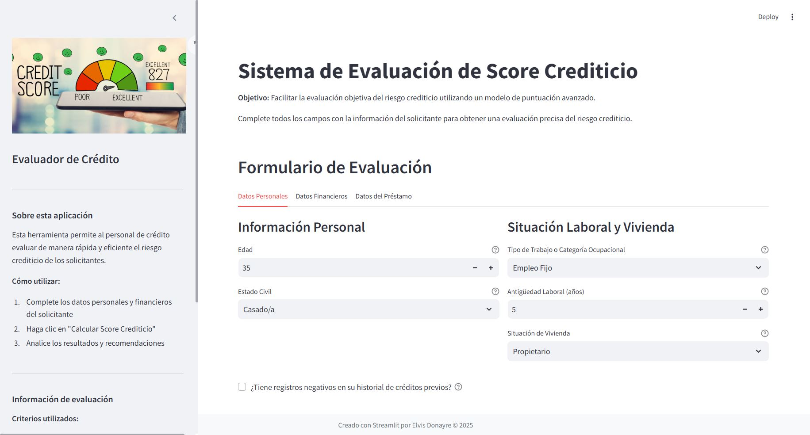

# 📊 Modelo de Credit Scoring para Evaluación de Riesgo Crediticio

## 🎯 Descripción del Problema de Negocio

Este proyecto aborda un problema fundamental en el sector financiero: la evaluación del riesgo crediticio. Las instituciones financieras necesitan determinar de manera precisa la probabilidad de que un solicitante de crédito incumpla con sus obligaciones de pago (default). 

El modelo de credit scoring desarrollado permite:
- Automatizar decisiones de aprobación/rechazo de préstamos
- Reducir el riesgo de pérdidas por impagos
- Asignar recursos de manera más eficiente
- Ofrecer condiciones de préstamo personalizadas según el perfil de riesgo

El enfoque del proyecto prioriza la precisión (minimizar falsos positivos) para evitar conceder créditos a clientes con alto riesgo de impago, lo que podría suponer pérdidas significativas para la institución.

## 📋 Variables Originales del Dataset

- **status**: Estado actual del crédito
- **seniority**: Años de experiencia laboral
- **home**: Tipo de vivienda del solicitante
- **time**: Plazo del préstamo en meses
- **age**: Edad del solicitante
- **marital**: Estado civil
- **records**: Historial de créditos previos
- **job**: Categoría ocupacional
- **expenses**: Gastos mensuales reportados
- **income**: Ingresos mensuales
- **assets**: Valor de ahorros o activos
- **debt**: Obligaciones financieras actuales
- **amount**: Monto solicitado en el préstamo
- **price**: Prima o valor total a devolver por el crédito

## 📈 Visualizaciones Disponibles

El repositorio incluye varias visualizaciones para entender mejor los datos:
- `distribucion_status.png`: Muestra la distribución de la variable objetivo
- `efecto_tratamiento_outliers`: Visualiza cómo el tratamiento de valores atípicos mejora el modelo
- `Distribucion_variables_categoricas.JPG`: Distribución de variables categóricas originales
- `Distribucion_variables_categoricas_reagrupadas`: Distribución después de reagrupar categorías

## ⚙️ Ingeniería de Características

Se han creado nuevas variables para capturar relaciones más complejas entre los datos originales:

### 💰 Ratios Financieros
- **dti_ratio**: Relación deuda/ingresos - indicador clave de capacidad de pago
- **lti_ratio**: Relación préstamo/ingresos - mide si el monto solicitado es proporcional a los ingresos
- **expense_income_ratio**: Relación gastos/ingresos - indica cuánto del ingreso se destina a gastos
- **net_worth**: Patrimonio neto (activos - deudas)
- **price_amount_ratio**: Relación entre el precio total y el monto solicitado

### 🔄 Transformaciones de Variables
- **log_income**: Logaritmo de ingresos para normalizar distribuciones sesgadas
- **log_assets**: Logaritmo de activos

### 👨‍👩‍👧‍👦 Variables Basadas en Edad
- **age_group**: Categorización de edades en grupos (<25, 25-35, 35-45, 45-55, 55-65, 65+)
- **seniority_age_ratio**: Relación entre experiencia laboral y edad

### 💵 Capacidad de Pago
- **payment_capacity**: Capacidad de pago considerando ingresos, deudas y gastos
- **financial_burden**: Carga financiera (porcentaje del ingreso destinado a deudas)
- **loan_coverage_months**: Meses de ingreso necesarios para cubrir el préstamo

### 📏 Variables Normalizadas
- Variables principales normalizadas a escala 0-1 (income_norm, expenses_norm, etc.)

### 🔀 Variables Dummy
- Transformación de variables categóricas (home, marital, records, job, age_group) en variables dummy

## 🤖 Proceso de Modelado

### ⚖️ Balanceo de Clases
El dataset original presenta un desbalance en la variable objetivo (default_final). Se utiliza la técnica SMOTE (Synthetic Minority Over-sampling Technique) para equilibrar las clases en el conjunto de entrenamiento.

### 🧪 Modelos Evaluados
- Regresión Logística
- Random Forest
- Gradient Boosting
- SVM (Support Vector Machine)
- KNN (K-Nearest Neighbors)
- Árbol de Decisión

### 🎚️ Umbral de Clasificación Personalizado
Se implementa un clasificador con umbral personalizado (0.3) para favorecer la precisión sobre otras métricas, evitando así los falsos positivos (predecir que un cliente pagará cuando en realidad no lo hará).

### 🔍 Selección y Optimización
- El mejor modelo se selecciona basado en la métrica de precisión
- Se realiza optimización de hiperparámetros mediante GridSearchCV
- Se comparan los resultados antes y después de la optimización

### 🏆 Resultados Finales
El modelo optimizado ofrece un equilibrio entre precisión y exhaustividad, priorizando la reducción de falsos positivos para minimizar el riesgo de pérdidas crediticias.

## 🚀 Uso del Modelo

El modelo final entrenado se guarda en formato pickle ('modelo_clasificacion_precision.pkl') junto con:
- El scaler utilizado para normalizar los datos
- Los nombres de las características necesarias
- El umbral personalizado de clasificación

Esto permite utilizar el modelo para evaluar nuevas solicitudes de crédito de manera consistente.

## 🌐 Demo Interactiva con Streamlit

Puedes probar el modelo de forma interactiva a través de una aplicación Streamlit. Esta interfaz permite a usuarios sin conocimientos técnicos evaluar nuevas solicitudes de crédito y visualizar los resultados en tiempo real.

### Cómo ejecutar la demo:

1. **Instalación de dependencias**:
   ```bash
   pip install streamlit pandas numpy scikit-learn pickle
   ```

2. **Ejecutar la aplicación**:
   ```bash
   streamlit run app.py
   ```

3. **Funcionalidades de la demo**:
   - Formulario interactivo para ingresar datos del solicitante
   - Visualización de la probabilidad de default
   - Recomendación de aprobación/rechazo basada en el umbral personalizado
   - Explicación de los factores más influyentes en la decisión



### Acceso online:
La demo ya está desplegada y disponible en Streamlit Cloud. Puedes acceder directamente sin necesidad de instalación local:
[https://credit-scoring-demo.streamlit.app](https://credit-scoring-demo-elvis.streamlit.app)

Esta versión en la nube permite probar el modelo instantáneamente desde cualquier dispositivo con acceso a internet.

## 🛠️ Requisitos Técnicos

El proyecto utiliza principalmente las siguientes bibliotecas de Python:
- pandas y numpy para manipulación de datos
- scikit-learn para modelos de aprendizaje automático
- imbalanced-learn para técnicas de balanceo (SMOTE)
- matplotlib y seaborn para visualizaciones

## 🔮 Posibles Mejoras y Trabajo Futuro

Este proyecto está en constante evolución y se irá mejorando con el tiempo. Algunas áreas de mejora planificadas incluyen:

### Mejoras en el Modelo
- Implementación de técnicas de aprendizaje profundo para capturar relaciones más complejas
- Exploración de modelos de ensamble más avanzados
- Validación cruzada con múltiples pliegues para una evaluación más robusta
- Calibración de probabilidades para mejorar la interpretación del score

### Mejoras en las Características
- Incorporación de variables macroeconómicas que podrían afectar el comportamiento de pago
- Desarrollo de características temporales para capturar patrones estacionales
- Técnicas de selección de características más sofisticadas

### Mejoras en la Interfaz de Usuario
- Añadir explicaciones detalladas sobre cada variable y su impacto
- Implementar visualizaciones interactivas sobre cómo diferentes variables afectan el riesgo
- Desarrollar un panel de control para monitorear el rendimiento del modelo en tiempo real

### Mejoras Técnicas
- Despliegue del modelo como una API REST para integración con otros sistemas
- Implementación de monitoreo de deriva de datos para detectar cuando el modelo necesita reentrenamiento
- Pipeline de CI/CD para actualización automática del modelo con nuevos datos

## 🔄 Desarrollo Continuo

Este código estará en constante actualización para incorporar:
- Nuevos datos y tendencias del mercado
- Avances en técnicas de modelado de riesgo crediticio
- Retroalimentación de usuarios y stakeholders
- Mejoras de rendimiento y escalabilidad

Si deseas contribuir o tienes sugerencias, no dudes en abrir un issue o enviar un pull request en este repositorio. ¡Todas las contribuciones son bienvenidas!
